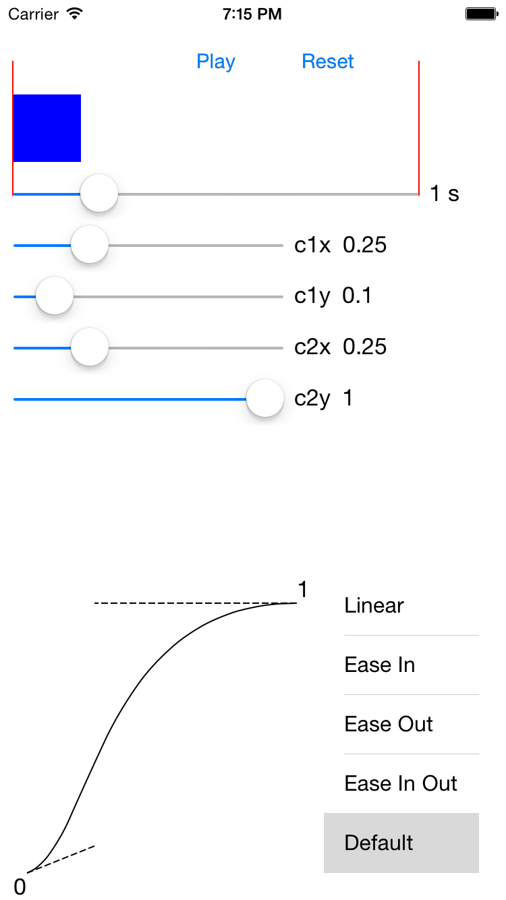

Custom Animations Playground
---

This project is a simple iOS app that provides a way to experiment with custom `CAAnimation` timing functions, which are specified as two-dimensional Bézier curves. App's UI allows customizing the curve's control points positions and play the resulting animation with the selected duration. Built-in timing functions are also available in the app as starting points for experimenting.

